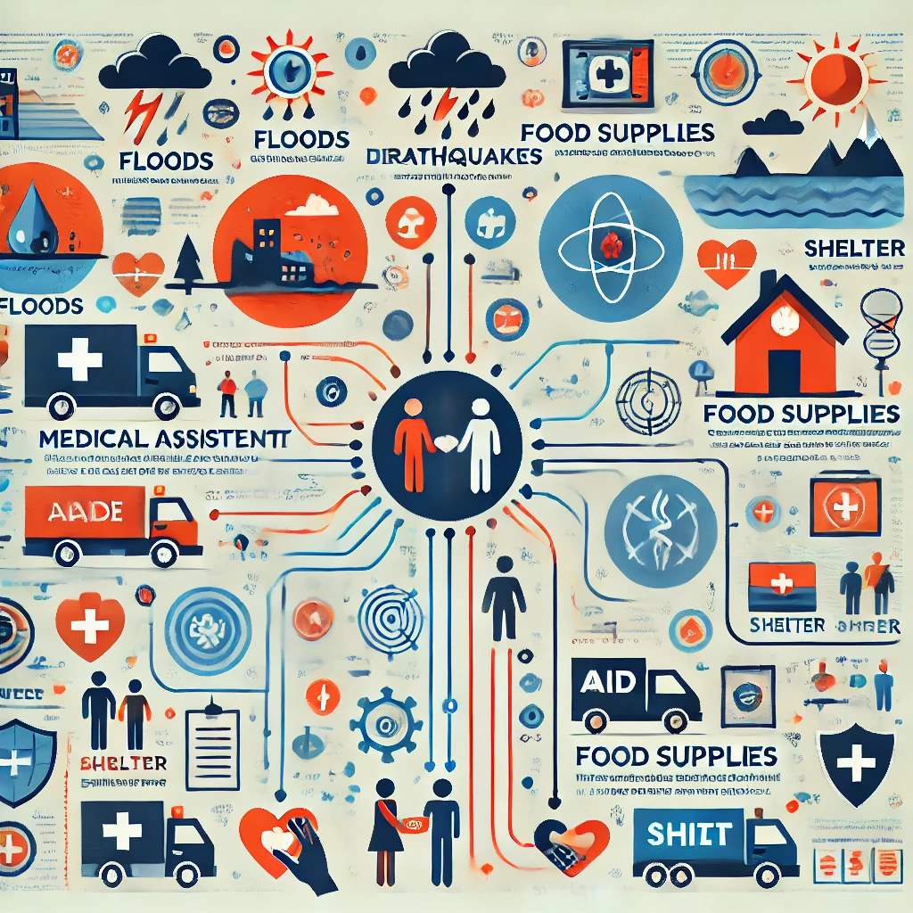
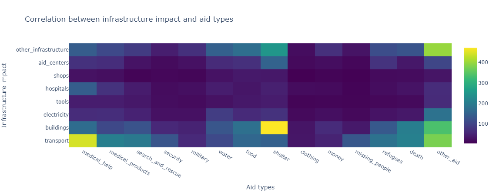

# Analysis of correlations between weather events / infrastructure impact and aid types



## Project Overview

This project is designed to build an end-to-end pipeline for disaster response messages. The aim is to analyze the distribution of weather events, infrastructure impact and requested aid and their correlation.

The project consists of three main components: an ETL pipeline, a machine learning pipeline, and a Flask web app for data visualization and user interaction.


## Project Components

### 1. **ETL Pipeline**
The ETL pipeline is responsible for processing and cleaning the data from two datasets: messages and categories. The cleaned data is stored in a SQLite database for further use in the machine learning pipeline.

- **Script**: `process_data.py`
- **Steps**:
  1. Load the messages and categories datasets from CSV files.
  2. Merge the two datasets.
  3. Clean the data by:
     - Splitting categories into individual columns.
     - Converting category values to binary.
     - Removing duplicates and handling missing data.
  4. Save the cleaned data to a SQLite database.

### 2. **ML Pipeline**
The machine learning pipeline builds a text classification model to categorize disaster response messages. It leverages natural language processing (NLP) and machine learning algorithms to train and evaluate the model.

- **Script**: `train_classifier.py`
- **Steps**:
  1. Load data from the SQLite database.
  2. Split the dataset into training and testing sets.
  3. Build a text processing and classification pipeline using `CountVectorizer`, `TfidfTransformer`, and `RandomForestClassifier`.
  4. Tune hyperparameters using `GridSearchCV`.
  5. Train and evaluate the model on the test set.
  6. Export the final model as a pickle file (`classifier.pkl`).

### 3. **Flask Web App**

The web app consists of two parts:
- It visualizes the distribution of weather events, infrastructure impact and requested aid and their correlation using Plotly.
- It also allows users to input new disaster messages and returns the matching classification results.

- **Files**:
  - `app.py`: Flask web server
  - `templates/go.html`: HTML template for the classification results
  - `templates/master.html`: HTML template for the app layout
- **Steps**:
  1. Modify file paths to connect the app with the SQLite database and the trained model.
  2. Display interactive data visualizations using Plotly. These are:
     - Bar charts for deisplaying the distributions of:
       - Requested aid
       - Infrastructure impact
       - Weather event
     - A pie chart showing the frequency of message types
     - Heatmaps showing the correlation between the requested aid and:
       - Requested aid
       - Infrastructure impact
       - Weather event

## Data Visualizations

The web app includes seven interactive data visualizations created using Plotly:

1. **Barchart: Distribution of Aid Requests**
   - This bar chart displays the frequency of different types of aid requests in the dataset. It helps identify the most commonly requested aid types (e.g., medical help, shelter, food, etc.):

   

   Here we can see, that there are lots of unclassified aid requests only stating "other_aid". As expected food, medical aid, shelter and water are among the most often requested aids. In the datasets there was no aid requested for a missing_child.

2. **Barchart: Distribution of Infrastructure Impact**
   - This chart shows the distribution of impacts on various types of infrastructure (e.g., transport, electricity, hospitals, etc.). It highlights how different disasters impact critical infrastructure and which types are most affected:

   

   It shows that here are also a lot of unclassified infrastructure impacts only referred to as "other_infrastructure". As expected the generic class "building" is impacted most often.

3. **Barchart: Distribution of Weather Events**
   - This visualization displays the frequency of various weather events (e.g., floods, storms, fires, earthquakes). It helps in understanding which weather events are most prevalent in the dataset:

   

   Here we learn, that there are far more earthquakes and storms than fires causing disasters.

4. **Piechart: Frequency of Aid Requests by Message Type**
   - This pie chart shows the distribution of messages by genre (e.g., direct, news, social). It provides insights into how people communicate disaster-related information across different media types:

   

   What is expected here is that there are far more aids requested directly that via social contacts or media. What is surprising is, that there are even more aids requested via news.

5. **Heatmap: Correlation Matrix of Aid Requests**
   - This heatmap visualizes the correlation between different types of aid requests. It helps identify potential relationships between various aid categories (e.g., if requests for shelter often coincide with requests for food):

   

   This shows that the strongest correlations are between "food" and "water" and between "medical help" and "medical products", what is kind of trivial. Other strong relations are between "water" and "medical products", between "food" and "shelter" and between "search and rescue" and "missing people".

   The weakest correlations are between "death" and "money", between "security" and "money" and between "military" and "money".

   The strongest negative correlations are between "military" and "food" and between "military" and "shelter", so the request for military aid seems to contradict the request for other aids most often.

6. **Heatmap: Correlation Between Infrastructure Impact and Aid Types**
   - This heatmap explores the relationship between infrastructure impacts (e.g., transport, electricity) and the types of aid requested. It helps identify patterns in how infrastructure damage drives specific aid requests:

   

   Since "other_aid" is not classified it is hard to learn something from this.

   Besides that the strongest correlation is between "floods" and "medical help". Also "shelter" seems to be requested quite often when there is infrastructure impact.

   The weakest correlations show, that in case of fire the least requested aids are "food", "clothing" and "missing_people".

7. **Heatmap: Correlation Between Weather Events and Aid Types**
   - This heatmap shows the correlation between specific weather events and the types of aid requested in response to those events. It provides insight into how different disasters impact aid needs:

   

   Since "other_aid" is not classified it is hard to learn something from this.

   Besides that the strongest correlation is between "building" and "shelter", which seems trivial, and between "transport" and medical_help, which ist a bit surprising.

   The weakest correlation is between "shops" and "clothing" and between "shops" and "missing_people".

## Classifying your own message

Insert a message into the textbox and click on "Classify message" to get the classification results displayed. The results contain information about the aid requested, the infrastructure impact and the weather event.

## Project Setup

### Prerequisites
Make sure you have the following libraries installed:
- Python 3.x
- Flask
- Pandas
- NumPy
- Scikit-learn
- SQLAlchemy
- NLTK
- Plotly
- Joblib

You can install the required libraries by running:
```bash
pip install -r requirements.txt
```

### Usage

Run the ETL Pipeline: This script loads, cleans, and saves the data to a SQLite database.
```
python process_data.py disaster_messages.csv disaster_categories.csv DisasterResponse.db
```
Run the Machine Learning Pipeline: This script trains and saves the classifier as a pickle file.
```
python train_classifier.py ../data/DisasterResponse.db classifier.pkl
```
Run the Web App: To launch the Flask web app, run:
```
python app.py
```
Then navigate to http://127.0.0.1:3000/ in your browser.

## File Structure
```
├── app.py                   # Flask web app
├── process_data.py           # ETL pipeline script
├── train_classifier.py       # ML pipeline script
├── templates/
│   └── master.html           # HTML template for the web app
├── static/
│   └── style.css             # CSS file for web app styling
├── data/
│   ├── disaster_messages.csv  # Dataset with messages
│   ├── disaster_categories.csv# Dataset with categories
│   └── DisasterResponse.db    # SQLite database
├── models/
│   └── classifier.pkl         # Trained ML model (pickle file)
├── README.md                 # Project documentation
└── requirements.txt          # Python package dependencies
```

## Code Quality & Version Control

The project uses git for versioning.

### Contributing

Contributions are welcome! Please feel free to submit a pull request or open an issue if you have suggestions or improvements.

1. Fork the repository.
2. Create a new branch (git checkout -b feature-branch).
3. Make your changes and commit them (git commit -m 'Add new feature').
4. Push to the branch (git push origin feature-branch).
5. Submit a pull request.

## Conclusion
This project demonstrates the full cycle of building a disaster response classification system, from ETL and machine learning pipelines to web app deployment.

By analyzing the correlations, this system helps disaster relief organizations prepare for specific requests in hazarded locations.